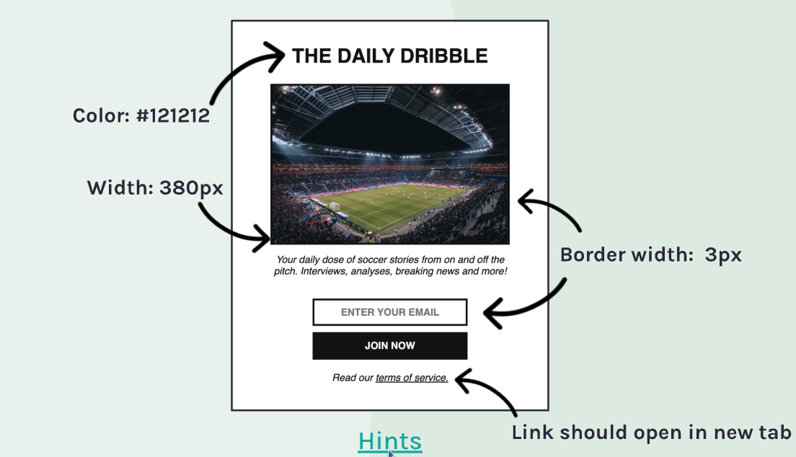
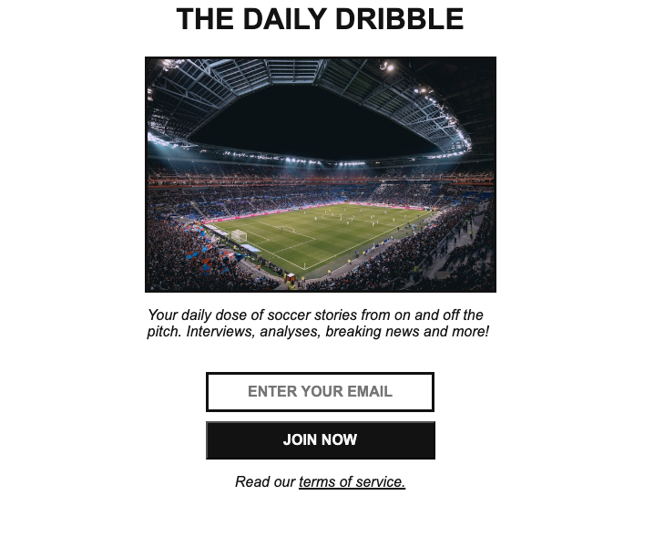

# Daily Dribble Newsletter Signup

A responsive newsletter signup page for a soccer news service, built with HTML and CSS. This was my first solo project from the Scrimba HTML and CSS Tutorial.

## Project Overview
- Clean, modern newsletter signup design
- Responsive layout
- Custom styling for form elements
- External link handling

## Design vs. Implementation

### Design Specifications

### My Implementation

## Technologies Used
- HTML5
- CSS

## What I Learned
- How to match a design specification
- Working with form elements
- CSS layout and positioning
- Border styling and color management
- How to deploy a project to GitHub

